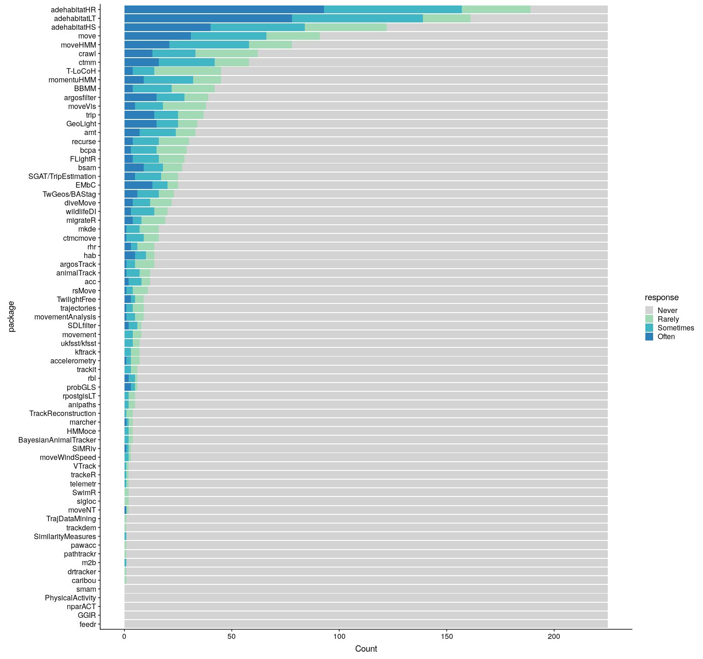
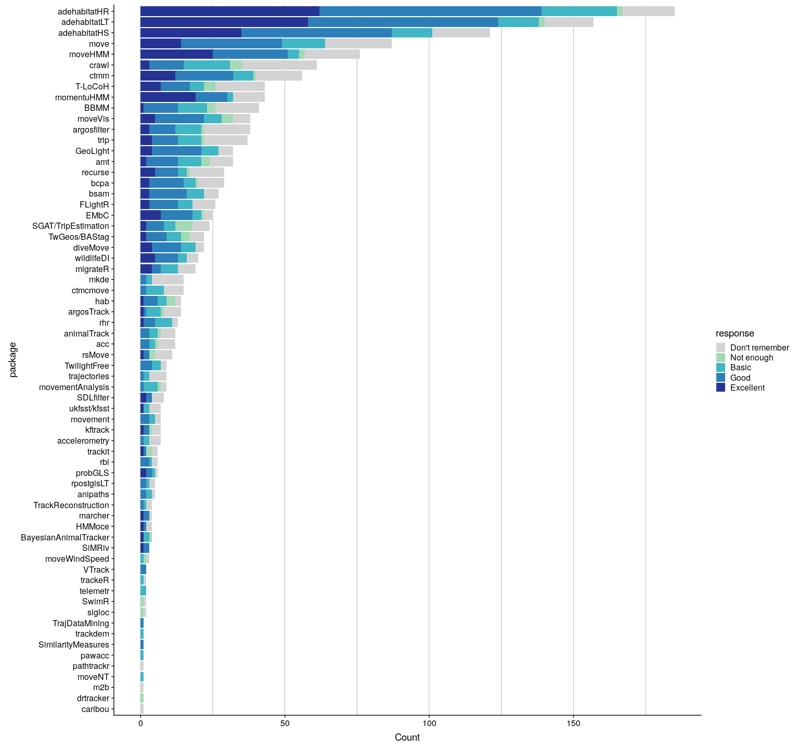

Navigating through the R packages for movement: Supporting information
================
Rocio Joo, Matthew E. Boone, Thomas A. Clay, Samantha C. Patrick, Susana Clusella-Trullas, and Mathieu Basille
May 15, 2019

-   [A large amount of R packages for movement and the need for a survey](#a-large-amount-of-r-packages-for-movement-and-the-need-for-a-survey)
-   [Packages included in the survey](#packages-included-in-the-survey)
-   [Participation in the survey](#participation-in-the-survey)
-   [The questions](#the-questions)
    -   [User level](#user-level)
    -   [Package use](#package-use)
    -   [Package documentation](#package-documentation)
-   [Package Revelance](#package-revelance)
-   [Survey representativity](#survey-representativity)
-   [Summary](#summary)

A large amount of R packages for movement and the need for a survey
-------------------------------------------------------------------

This repository is a companion to the manuscript "*Navigating through the R packages for movement: a review for users and developers*", from Rocio Joo, Matthew E. Boone, Thomas A. Clay, Samantha C. Patrick, Susana Clusella-Trullas, and Mathieu Basille. The manuscript is a review of R packages for movement. R is one of the most used programming softwares to process, visualize and analyze data from tracking devices. The large amount of existing packages makes it difficult to keep track of the spectrum of choices. Our review aimed at an objective introduction to the packages organized by the type of processing or analyzing they focused on, and to provide feedback to developers from a user perspective. For the second objective, we elaborated a survey for package users regarding:

1.  How popular those packages are;
2.  How well documented they are;
3.  How relevant they are for users.

Those were the three questions that we asked about the packages, plus one about the level as an R user of the survey participant. In the review we showed results regarding package documentation. In this document, we present the complete results of the survey. Note that this document is actually a dynamic R report, which RMarkdown sources are also available [here](README.Rmd) with full code.

Packages included in the survey
-------------------------------

In theory, any package could be potentially useful for movement analysis; either a time series package, a spatial analysis one or even `ggplot2` to make more beautiful graphics! For the review, we considered only what we referred to as **tracking packages**. Tracking packages were those created to either analyze tracking data (i.e. (*x*, *y*, *t*)) or to transform data from tagging devices into proper tracking data. For instance, a package that would use accelerometer, gyroscope and magnetometer data to reconstruct an animal's trajectory via path integration, thus transforming those data into an (*x*, *y*, *t*) format, would fit into the definition. But a package analyzing accelerometry series to detect changes in behavior would not fit.

For this survey, we added packages that, though not tracking packages *per se*, were created to process or analyze data extracted from tracking devices in other formats (e.g. `accelerometry` for accelerometry data, `diveMove` for time-depth recorders or `pathtrackr` for video tracking data). Packages from any public repository (e.g. CRAN, GitHub, R-forge) were included in the survey. Packages created for eye, computer-mouse or fishing vessel movement were not considered here. A couple of packages that were finally discarded from the review because of either being in early stages of development (`movement`) or because of being archived in CRAN due to unfixed problems (`sigloc`), were included in the survey. Two packages, `lsmnsd` and `segclust2d`, were added for an updated version of the review but did not make it in time for the survey. The package `trajr` was added to the survey in a late stage, but because of that, and the fact that it got only one response, we filtered it out of the analysis.

A total of 72 packages were included in this survey: `acc`, `accelerometry`, `adehabitatHR`, `adehabitatHS`, `adehabitatLT`, `amt`, `animalTrack`, `anipaths`, `argosfilter`, `argosTrack`, `BayesianAnimalTracker`, `BBMM`, `bcpa`, `bsam`, `caribou`, `crawl`, `ctmcmove`, `ctmm`, `diveMove`, `drtracker`, `EMbC`, `feedR`, `FLightR`, `GeoLight`, `GGIR`, `hab`, `HMMoce`, `Kftrack`, `m2b`, `marcher`, `migrateR`, `mkde`, `momentuHMM`, `move`, `moveHMM`, `movement`, `movementAnalysis`, `moveNT`, `moveVis`, `moveWindSpeed`, `nparACT`, `pathtrackr`, `pawacc`, `PhysicalActivity`, `probgls`, `rbl`, `recurse`, `rhr`, `rpostgisLT`, `rsMove`, `SDLfilter`, `SGAT/TripEstimation`, `sigloc`, `SimilarityMeasures`, `SiMRiv`, `smam`, `SwimR`, `T-LoCoH`, `telemetr`, `trackdem`, `trackeR`, `Trackit`, `TrackReconstruction`, `TrajDataMining`, `trajectories`, `trip`, `TwGeos`/`BAStag`, `TwilightFree`, `Ukfsst`/`kfsst`, `VTrack` and `wildlifeDI`.

Participation in the survey
---------------------------

The survey was designed to be completely anonymous, meaning that we had no way to know who participated. There was no previous selection of the participants and no probabilistic sampling was involved. The survey was advertised by Twitter, mailing lists (r-sig-geo and r-sig-ecology), individual emails to researchers and the [lab's website](https://mablab.org/post/2018-08-31-r-movement-review/).

The survey got exemption from the Institutional Review Board aqt University of Florida (IRB02 Office, Box 112250, University of Florida, Gainesville, FL 32611-2250).

A total of 446 people participated in the survey, and 225 answered all four questions. To answer all questions the participant had to have tried at least one of the packages. In the following sections, we analyze only completed surveys.

The questions
-------------

### User level

Let's see first the level of use in R of the participants. The options were:

-   Beginner: You only use existing packages and occasionally write some lines of code.
-   Intermediate: You use existing packages but you also write and optimize your own functions.
-   Advanced: You commonly use version control or contribute to develop packages.

Most participants considered themselves in an intermediate level (60.9), meaning that they could write functions in R. Some others were beginners (18.7) and advanced (20.4) R users.

### Package use

The first question about package use was: How often do you use each of these packages? (Never, Rarely, Sometimes, Often)

The bar graphics below show that most packages were unknown (or at least had never been used) by the survey participants. The `adehabitat` packages (HR, LT and HS) were the most used packages. These packages provide a collection of tools to estimate home range, handle and analyze trajectories, and analyze habitat selection, respectively. On the bottom of the graphic, `smam` (for animal movement models), `PhysicalActivity`, `nparACT`, `GGIR` (these three for accelerometry data on human patients) and `feedr` (to handle radio telemetry data) had no users among the participants. For that reason, those 5 packages will not appear in the analysis of the next questions.

If you want to check the numbers for specific packages, the complete table is below:

|                       |  Never|  Rarely|  Sometimes|  Often|
|-----------------------|------:|-------:|----------:|------:|
| acc                   |    213|       4|          6|      2|
| accelerometry         |    218|       4|          2|      1|
| adehabitatHR          |     36|      32|         64|     93|
| adehabitatHS          |    103|      38|         44|     40|
| adehabitatLT          |     64|      22|         61|     78|
| amt                   |    192|       9|         17|      7|
| animalTrack           |    213|       5|          6|      1|
| anipaths              |    220|       3|          2|      0|
| argosfilter           |    186|      11|         13|     15|
| argosTrack            |    211|       9|          4|      1|
| BayesianAnimalTracker |    221|       2|          2|      0|
| BBMM                  |    183|      20|         18|      4|
| bcpa                  |    196|      14|         12|      3|
| bsam                  |    198|       9|          9|      9|
| caribou               |    224|       1|          0|      0|
| crawl                 |    163|      29|         20|     13|
| ctmcmove              |    209|       7|          8|      1|
| ctmm                  |    167|      16|         26|     16|
| diveMove              |    203|      10|          8|      4|
| drtracker             |    224|       1|          0|      0|
| EMbC                  |    200|       5|          7|     13|
| feedr                 |    225|       0|          0|      0|
| FLightR               |    197|      12|         12|      4|
| GeoLight              |    191|       9|         10|     15|
| GGIR                  |    225|       0|          0|      0|
| hab                   |    211|       4|          5|      5|
| HMMoce                |    221|       2|          2|      0|
| kftrack               |    218|       4|          3|      0|
| m2b                   |    224|       0|          1|      0|
| marcher               |    221|       2|          1|      1|
| migrateR              |    206|      11|          4|      4|
| mkde                  |    209|       9|          6|      1|
| momentuHMM            |    180|      13|         23|      9|
| move                  |    134|      25|         35|     31|
| moveHMM               |    147|      20|         37|     21|
| movement              |    217|       4|          4|      0|
| movementAnalysis      |    216|       4|          4|      1|
| moveNT                |    223|       1|          0|      1|
| moveVis               |    187|      20|         13|      5|
| moveWindSpeed         |    222|       1|          2|      0|
| nparACT               |    225|       0|          0|      0|
| pathtrackr            |    224|       1|          0|      0|
| pawacc                |    224|       1|          0|      0|
| PhysicalActivity      |    225|       0|          0|      0|
| probGLS               |    219|       1|          2|      3|
| rbl                   |    219|       1|          3|      2|
| recurse               |    195|      14|         12|      4|
| rhr                   |    211|       8|          3|      3|
| rpostgisLT            |    220|       3|          2|      0|
| rsMove                |    214|       7|          3|      1|
| SDLfilter             |    217|       2|          4|      2|
| SGAT/TripEstimation   |    200|       8|         12|      5|
| sigloc                |    223|       2|          0|      0|
| SimilarityMeasures    |    224|       0|          1|      0|
| SiMRiv                |    222|       1|          1|      1|
| smam                  |    225|       0|          0|      0|
| SwimR                 |    223|       2|          0|      0|
| T-LoCoH               |    180|      31|         10|      4|
| telemetr              |    223|       1|          1|      0|
| trackdem              |    224|       1|          0|      0|
| trackeR               |    223|       1|          1|      0|
| trackit               |    219|       3|          3|      0|
| TrackReconstruction   |    221|       3|          1|      0|
| TrajDataMining        |    224|       1|          0|      0|
| trajectories          |    216|       5|          3|      1|
| trip                  |    188|      12|         11|     14|
| TwGeos/BAStag         |    202|       7|         10|      6|
| TwilightFree          |    216|       4|          2|      3|
| ukfsst/kfsst          |    218|       3|          4|      0|
| VTrack                |    223|       1|          1|      0|
| wildlifeDI            |    205|       6|         11|      3|

There is actually not much difference in the number of packages used by the distinct levels of R users as you can see in the boxplots below:

### Package documentation

Without proper user testing and peer editing, package documentation can lead to large gaps of understanding and limited usefulness of the package. If functions and workflows are not expressly defined, a package's capacity to help users is undermined.

In this survey we asked the participants how helpful was the documentation provided for each of the packages they stated to use. Documentation includes what is contained in the manual and help pages, vignettes, published manuscripts, and other material about the package provided by the authors. The participants had to answer using one of the following options:

-   Not enough: "It's not enough to let me know how to do what I need"
-   Basic: "It's enough to let me get started with simple use of the functions but not to go further (e.g. use all arguments in the functions, or put extra variables)"
-   Good: "I did everything I wanted and needed to do with it"
-   Excellent: "I ended up doing even more than what I planned because of the excellent information in the documentation"
-   Don't remember: "I honestly can't remember…"

Remember that participants could only give their opinion on documentation regarding the packages they had used. Hence, the packages with many users got many documentation answers (Fig. 1 and 4). Figure 5 allows for a closer look at the proportion of type of response for each package.

To identify some packages with remarkably good documentation, let's first only consider those packages with at least 10 responses on the quality of documentation (regardless of the "Don't remember"). These are 27 (you can see the table of responses below). Among them, `momentuHMM` had more than 50% of the responses (59.38; 19) as "excellent documentation", meaning that the documentation was so good that thanks to it, more than half of its users discovered additional features of the package and were able to do more analyses than what they initially planned. Moreover, 11 packages had more than 75% of the responses as either "good" or "excellent": `momentuHMM` (93.75; 30), `moveHMM` (89.47; 51), `adehabitatLT` (88.57; 124), `adehabitatHS` (86.14; 87), `adehabitatHR` (83.23; 139), `EMbC` (81.82; 18), `wildlifeDI` (81.25; 13), `ctmm` (80; 32), `GeoLight` (77.78; 21), `move` (76.56; 49), `recurse` (76.47; 13). The two leading packages, `momentuHMM` and `moveHMM`, focus on the use of Hidden Markov models which allow identifying different patterns of behavior called states.

|                       |  Not enough|  Basic|  Good|  Excellent|  Don't remember|
|-----------------------|-----------:|------:|-----:|----------:|---------------:|
| acc                   |           1|      2|     3|          0|               6|
| accelerometry         |           0|      2|     1|          0|               4|
| adehabitatHR          |           2|     26|    77|         62|              18|
| adehabitatHS          |           0|     14|    52|         35|              20|
| adehabitatLT          |           2|     14|    66|         58|              17|
| amt                   |           3|      8|    11|          2|               8|
| animalTrack           |           1|      3|     3|          0|               5|
| anipaths              |           0|      2|     2|          0|               1|
| argosfilter           |           1|      9|     9|          3|              16|
| argosTrack            |           1|      5|     1|          1|               6|
| BayesianAnimalTracker |           1|      2|     0|          1|               0|
| BBMM                  |           3|     10|    12|          1|              15|
| bcpa                  |           1|      4|    12|          3|               9|
| bsam                  |           0|      6|    13|          3|               5|
| caribou               |           0|      0|     0|          0|               1|
| crawl                 |           4|     16|    12|          3|              26|
| ctmcmove              |           0|      6|     2|          0|               7|
| ctmm                  |           1|      7|    20|         12|              16|
| diveMove              |           0|      5|    10|          4|               3|
| drtracker             |           1|      0|     0|          0|               0|
| EMbC                  |           1|      3|    11|          7|               3|
| FLightR               |           0|      5|    10|          3|               8|
| GeoLight              |           0|      6|    17|          4|               5|
| hab                   |           3|      3|     5|          1|               2|
| HMMoce                |           0|      0|     1|          1|               2|
| kftrack               |           1|      0|     2|          1|               3|
| m2b                   |           0|      0|     0|          0|               1|
| marcher               |           0|      0|     2|          1|               1|
| migrateR              |           0|      6|     3|          4|               6|
| mkde                  |           0|      2|     2|          0|              11|
| momentuHMM            |           0|      2|    11|         19|              11|
| move                  |           0|     15|    35|         14|              23|
| moveHMM               |           2|      4|    26|         25|              19|
| movement              |           0|      2|     3|          0|               2|
| movementAnalysis      |           1|      5|     1|          0|               2|
| moveNT                |           0|      1|     0|          0|               0|
| moveVis               |           4|      6|    17|          5|               6|
| moveWindSpeed         |           1|      1|     0|          0|               1|
| pathtrackr            |           0|      0|     0|          0|               1|
| pawacc                |           0|      1|     0|          0|               0|
| probGLS               |           0|      1|     2|          2|               1|
| rbl                   |           0|      1|     3|          0|               2|
| recurse               |           1|      3|     8|          5|              12|
| rhr                   |           0|      6|     4|          1|               2|
| rpostgisLT            |           0|      1|     2|          0|               2|
| rsMove                |           2|      0|     2|          1|               6|
| SDLfilter             |           0|      0|     2|          2|               4|
| SGAT/TripEstimation   |           6|      4|     6|          2|               6|
| sigloc                |           1|      0|     0|          0|               1|
| SimilarityMeasures    |           0|      0|     1|          0|               0|
| SiMRiv                |           0|      0|     2|          1|               0|
| SwimR                 |           1|      0|     0|          0|               1|
| T-LoCoH               |           4|      5|    10|          7|              17|
| telemetr              |           0|      2|     0|          0|               0|
| trackdem              |           0|      1|     0|          0|               0|
| trackeR               |           0|      1|     0|          0|               1|
| trackit               |           2|      0|     1|          1|               2|
| TrackReconstruction   |           0|      1|     1|          0|               2|
| TrajDataMining        |           0|      0|     1|          0|               0|
| trajectories          |           0|      2|     1|          0|               6|
| trip                  |           1|      8|     9|          4|              15|
| TwGeos/BAStag         |           3|      5|     7|          2|               5|
| TwilightFree          |           0|      3|     4|          0|               2|
| ukfsst/kfsst          |           0|      2|     0|          1|               4|
| VTrack                |           0|      0|     2|          0|               0|
| wildlifeDI            |           0|      3|     8|          5|               4|

Package Revelance
-----------------

Participants were asked how relevant was each of the packages they use for their work. They had to answer using one of the following options:

-   Not relevant: "I tried the package but really didn't find it a good use for my work"
-   Slightly relevant: "It helps in my work, but not for the core of it"
-   Important: "It's important for the core of my work, but if it didn't exist, there are other packages or solutions to obtain something similar"
-   Essential: "I wouldn't have done the key part of my work without this package"

The two barplots show the absolute and relative frequency of the answers for each package, respectively. We identified the packages that were highly relevant for their users, considering only those packages with at least 10 responses. Among these 33 packages, three were regarded as either "Important" or "Essential" for more than 75% of their users: `bsam` (81.48; 22), `adehabitatHR` (81.08; 150), and `adehabitatLT` (75.16; 118). `bsam` allows fitting Bayesian state-space models to animal tracking data.

If you want to check the numbers for specific package, the complete table is below:

|                       |  Not relevant|  Slightly relevant|  Important|  Essential|
|-----------------------|-------------:|------------------:|----------:|----------:|
| acc                   |             3|                  7|          1|          1|
| accelerometry         |             0|                  3|          3|          1|
| adehabitatHR          |             7|                 28|         75|         75|
| adehabitatHS          |             7|                 41|         53|         20|
| adehabitatLT          |             2|                 37|         63|         55|
| amt                   |             3|                  9|         10|         10|
| animalTrack           |             2|                  7|          3|          0|
| anipaths              |             1|                  4|          0|          0|
| argosfilter           |             4|                 13|         11|         10|
| argosTrack            |             4|                  3|          7|          0|
| BayesianAnimalTracker |             0|                  2|          2|          0|
| BBMM                  |             1|                 16|         18|          6|
| bcpa                  |             0|                 15|         12|          2|
| bsam                  |             0|                  5|         13|          9|
| caribou               |             1|                  0|          0|          0|
| crawl                 |             6|                 25|         16|         14|
| ctmcmove              |             2|                  8|          4|          1|
| ctmm                  |             1|                 20|         23|         12|
| diveMove              |             1|                 11|          5|          5|
| drtracker             |             1|                  0|          0|          0|
| EMbC                  |             1|                  6|          6|         12|
| FLightR               |             4|                  9|         10|          3|
| GeoLight              |             1|                  8|         13|         10|
| hab                   |             1|                  5|          5|          3|
| HMMoce                |             1|                  2|          1|          0|
| kftrack               |             0|                  5|          2|          0|
| m2b                   |             0|                  1|          0|          0|
| marcher               |             0|                  1|          1|          2|
| migrateR              |             3|                  8|          5|          3|
| mkde                  |             3|                  9|          2|          1|
| momentuHMM            |             1|                 14|         14|         15|
| move                  |             8|                 28|         25|         26|
| moveHMM               |             3|                 22|         31|         20|
| movement              |             1|                  3|          3|          0|
| movementAnalysis      |             1|                  2|          5|          1|
| moveNT                |             0|                  0|          1|          0|
| moveVis               |             5|                 22|          9|          2|
| moveWindSpeed         |             1|                  2|          0|          0|
| pathtrackr            |             1|                  0|          0|          0|
| pawacc                |             0|                  1|          0|          0|
| probGLS               |             0|                  1|          2|          3|
| rbl                   |             1|                  2|          3|          0|
| recurse               |             2|                  8|         14|          5|
| rhr                   |             2|                  6|          4|          1|
| rpostgisLT            |             0|                  1|          3|          1|
| rsMove                |             0|                  8|          1|          2|
| SDLfilter             |             0|                  3|          2|          3|
| SGAT/TripEstimation   |             2|                  9|          7|          6|
| sigloc                |             0|                  2|          0|          0|
| SimilarityMeasures    |             0|                  0|          1|          0|
| SiMRiv                |             0|                  0|          2|          1|
| SwimR                 |             2|                  0|          0|          0|
| T-LoCoH               |             5|                 22|         13|          3|
| telemetr              |             1|                  1|          0|          0|
| trackdem              |             0|                  0|          1|          0|
| trackeR               |             0|                  1|          1|          0|
| trackit               |             1|                  4|          1|          0|
| TrackReconstruction   |             2|                  0|          1|          1|
| TrajDataMining        |             0|                  0|          1|          0|
| trajectories          |             2|                  5|          1|          1|
| trip                  |             3|                 12|         12|         10|
| TwGeos/BAStag         |             2|                  5|          7|          8|
| TwilightFree          |             1|                  3|          3|          2|
| ukfsst/kfsst          |             0|                  6|          1|          0|
| VTrack                |             0|                  1|          0|          1|
| wildlifeDI            |             1|                  7|          6|          6|

Survey representativity
-----------------------

To get a rough idea of how representative the survey was of the population of the package users, we compared the number of participants that used each package to the number of monthly downloads that each package has.

The number of downloads were calculated using the R package `cran.stats`. It calculates the number of independent downloads by each package (substracting downloads by dependencies) by day. It only provides download statistics for packages on CRAN, downloaded using the RStudio CRAN mirror—total downloads are likely to be an order of magnitude higher. We computed the average number of downloads per month, from September 2017 to August 2018; fewer months were considered for packages that were younger than one year old.

There is no perfect match between the number of users and the number of downloads per package, but a correlation of 0.85 for the 49 packages on CRAN provides evidence of an overall good representation of the users of tracking packages in the survey. Moreover, most of the packages with very few users in the survey regardless of their relatively high download statistics were accelerometry packages for human patients, which would be revealing that we did not reach that subpopulation of users through Twitter and emails.

A log-log plot for both metrics is shown in the figure below.

Summary
-------

-   Most packages had very few users among the participants. The vast landscape of packages could be leading users to: 1) rely on "old" and established packages (like the `adehabitat` family) that gather most functions for common analyses in movement and 2) search for other packages when doing other specific analyses. Moreover, many packages contain functions that other packages have implemented too (see more details in the review manuscript), so repetition could make users spread between packages.
-   After the `adehabitat` family of packages, several packages for modeling animal movement (`momentuHMM`, `moveHMM`, `crawl` and `ctmm`) showed to be very popular, which could be an indicator of an increase in research on movement models.
-   Few of the packages had remarkably good documentation (&gt;75% of "good" or "excellent" documentation), and, on the other end of the spectrum, a couple of packages got less than 50% of "good" or "excellent" rates.
-   Most packages were relevant for the work of their users, which is a positive feature!
