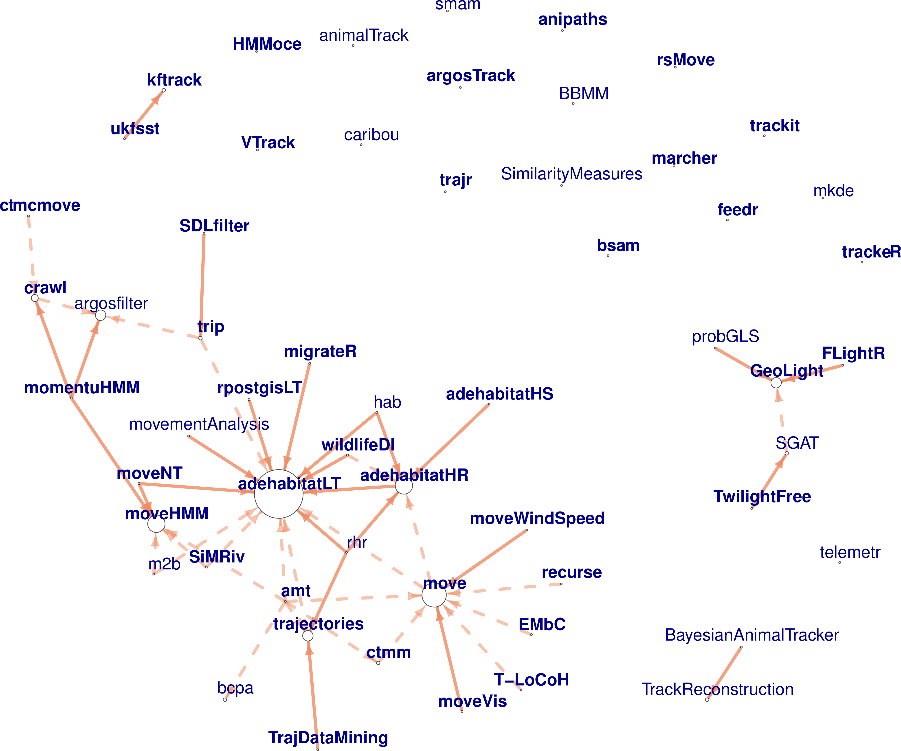

```{r setup, include=FALSE}
knitr::opts_chunk$set(echo = TRUE)
```

Are you doing research in movement ecology and an R user? Do you wonder sometimes about which packages to use? Or are you a developer and want to know how your package integrates to the current landscape of packages for movement analysis? Then, [this review](https://arxiv.org/abs/1901.05935) of R packages for movement is for you! Here is an extended abstract of our review:

As many of you know, the advent of biologging devices has provided ecologists with unparalleled opportunities to record animal movement across scales, and led to the collection of ever-increasing quantities of tracking data. In parallel, sophisticated tools to process, visualize and analyze tracking data have been developed in abundance. Within the R software alone, we listed 57 focused on these tasks, called here tracking packages.

We defined the tracking packages as those created to either analyze tracking data (i.e. (x, y, t)) or to transform data from tagging devices into proper tracking data. For instance, a package that would use accelerometer, gyroscope and magnetometer data to reconstruct an animal's trajectory via path integration, thus transforming those data into an (x,y,t) format, would fit into the definition. But a package analyzing accelerometry series to detect changes in behavior would not fit. We made a small section to mention these biologging but not tracking packages, but the review is not centered on them. 

We prepared the review as an introduction to this set of packages for researchers, and to provide feedback and recommendations to package developers, from a user perspective. We described each package based on a workflow centered around tracking data, broken down in three stages: pre-processing, post-processing, and analysis (data visualization, track description, path reconstruction, behavioral pattern identification, space use characterization, trajectory simulation and others).

Supporting documentation is key to the accessibility of a package for users. Based on a user survey, we reviewed the quality of packages' documentation, and identified 12 packages with good or excellent documentation. (Disclaimer: the results of the survey here as also preliminary. See next posts about the survey here <!---  need link --> .)

Links between packages were assessed through a network graph analysis. Although a large group of packages shows some degree of connectivity (either depending on functions or suggesting the use of another tracking package), a third of tracking packages work on isolation, reflecting a fragmentation in the R Movement-Ecology programming community.

Finally, we provide recommendations for users to choose packages, and for developers to maximize usefulness of their contribution and strengthen the links between the programming community.

This is only a preliminary version of the manuscript. Please feel free to leave as a comment about the review or to contact me at rocio.joo@ufl.edu. 



<!-- A pre-print of our work reviewing R tracking packages is available here: -->

<!-- We review R packages for processing or analysis of tracking data as an introduction to this -->
<!-- set of packages for researchers and provide feedback and recommendations to package developers, from a user perspective.  -->

<!-- <!-- The set of tracking packages reviewed here is a subset of the ones in the survey (see last post $\textit{there should be a link}). If you have read the previous post, this next explanation is for you.  --> -->

<!-- <!-- For the survey, we considered packages created with the main purpose of 1) processing or analyzing data obtained from devices used to track organisms, or 2) analyze tracking data in general. Tracking data would have space and time components, i.e. at least (x,y,t), or assuming t as a general index in regular steps.  --> -->
<!-- <!-- Using that definition of tracking data, accelerometry data, for example, would not be tracking data (it doesn't have a 2D spatial component), but it would be obtained from devices used to track organisms. Because it falls under the first condition, packages dealing with accelerometry data only were considered for the survey. The same happened with packages handling time-depth-recorder (TDR) data.  --> -->

<!-- In the manuscript, we reviewed only packages that were created to either analyze tracking data or to transform data from tagging devices into proper tracking data. For instance, a package that would use accelerometer, gyroscope and magnetometer data to reconstruct an animal's trajectory via path integration, thus transforming those data into an (x,y,t) format, would fit into the definition. But a package analyzing accelerometry series to detect changes in behavior would not fit. We made a small section to mention these packages, but the review is not centered on them.  -->

<!-- From the $72$ packages listed for the survey, $57$ were included in the review. These were $15$ left behind: -->

<!-- * $\texttt{acc}$, $\texttt{accelerometry}$, $\texttt{GGIR}$, $\texttt{nparACT}$, $\texttt{pawacc}$ and $\texttt{PhysicalActivity}$: accelerometry packages -->
<!-- *  -->
<!-- $6$ of them were accelerometry packages (), one was a TDR package ($\texttt{diveMove}$), one analyzes both TDR and accelerometer data {$\texttt{rbl}$}, "one" -->

